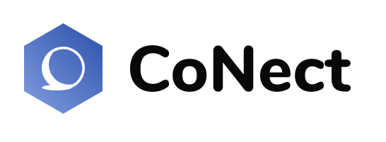

# DIU20
Prácticas Diseño Interfaces de Usuario 2019-20 (Economía Colaborativa) 

Grupo: DIU3.MAP  Curso: 2019/20 

Proyecto: CoNect

Descripción:    En este proyecto vamos a realizar una aplicación móvil donde se priorizará los sistemas de valoraciones y la comodidad para publicar o ver las actividades que sufren modificaciones, además añadiremos unos protocolos fáciles para poder registrarse, pagar o publicar actividades en la aplicación. 
Logotipo:    

Miembros
 *  Miguel Albertí Pons 

# Proceso de Diseño 

## Paso 1. UX Desk Research & Analisis 

 1.a Competitive Analysis
-----
Las aplicaciones que me han sido asignadas son aquellas en las cuales se facilita la búsqueda de actividades de ocio que se ajusten a los gustos de cada individuo.
Este conjunto de aplicaciones se caracterizan por ofrecer una lista de actividades divididas por unos filtros, comúnmente filtros de tipo de actividad como: deporte, gastronomía, arte, solidarias, etc; junto a filtros que acotan la zona geográfica donde buscar y filtros para acotar las fechas.
Una vez has encontrado la actividad deseada se pueden leer las condiciones generales y los requisitos que exige, finalmente cuando has visto todos los detalles se procede a pagar o a reservar la plaza según lo exija la actividad.

 1.b Persona
-----

* Enlace personas: https://github.com/MiguelAlberti/DIU20/blob/master/P1/Personas.pdf  

La primera persona que he escogido ha sido Pedro Borras, este joven estudiante que vive en un pueblo representa al conjunto de individuos que viven alejados de oportunidades de ocio diferentes y originales y se ve obligado a trasladarse a ciudades más grandes donde la oferta es mayor.  

En cambio Cristina Pascual tiene otro perfil, es una chica que ya tiene estudios e intenta emprender y crear una empresa capaz de organizar o publicitar eventos culturales, este tipo de usuarios representan a un conjunto de gente que a través de plataformas ya existentes quieren hacerse un hueco en el mercado.  

He escogido estos dos perfiles porque son casos bastante diferentes y porque creo que son dos situaciones que se pueden dar con gran facilidad actualmente. Esta técnica nos ha sido muy útil para poder contestar a la pregunta de ¿Para quien diseñamos?

 1.c User Journey Map
----
* Enlace Escenarios: https://github.com/MiguelAlberti/DIU20/blob/master/P1/Escenarios.pdf  

La historia de Pedro Borras la he escogido para reflejar todos los problemas que tiene una persona que vive en un pueblo alejado de grandes ciudades donde no solo debe preocuparse por encontrar la actividad adecuada sino que también por encontrar como llegar sin pagar un precio elevado por el trasporte, también intenta plasmar la falta de actividades bien sean de ocio o de otro tipo que hay en pueblos con un número de habitantes significativo.  

La historia de Cristina Pascual representa a una chica que ha acabado una carrera y un master y con lo aprendido quiere lograr crear una empresa que tenga relación con su pasión, el arte y eventos culturales de todo tipo, en el escenario podemos ver como cristina quiere hacerse hueco en el mercado y a través de fever consigue publicar un evento organizado por ella.  

 1.d Usability Review
----
* Página analizada: https://feverup.com/
* Enlace documento de Usability: https://github.com/MiguelAlberti/DIU20/blob/master/P1/Usability-review-template.xls
* Valoración final numérica: 83/100
* Comentario sobre la valoración: Es la primera vez que realizo una valoración de esta manera y en muchos puntos he dudado como valorar lo que me pedían, me he dado cuenta que apartados como en el de “form” no era necesario en esta app, ya que, registrarse en la página es muy simple, basta introducir el correo y tu contraseña para que todos tus datos de Google se relacionen con la app. Pese haber obtenido una buena puntuación tiene muchos aspectos a mejorar, sobretodo si quiere tener una comunidad que se comunique con facilidad a través de la app y donde un gran parte de usuarios publiquen actividades consiguiendo así una plataforma más dinámica.

## Paso 2. UX Design  

 2.a Feedback Capture Grid
----

* FeedbackCaptureGrid: https://github.com/MiguelAlberti/DIU20/blob/master/P2/FeedbackCaptureGrid.pdf

A partir del análisis de la etapa anterior y de haber realizado la feedback capture grid hemos encontrado muchos puntos a mejorar en la app fever.com, pero nos centraremos principalmente en los aspectos de **chat**, **valoraciones**, **notificaciones al publicar/modificar actividades**. En primer lugar realizaremos un sistema de nitificaciones tanto de actividades en las que estemos apuntados y sufran modificaciones como dar la posibilidad de suscriberse a algun tipo de actividad en específico y recibir notificaciones cuando se publiquen nuevas actividades. En segundo lugar creamos un sistema de valoraciones y comentarios presente en todas las actividades no como actualemente que solo esta presente en algunas y finalmente simplificar el proceso de de publicar una publicación estableciendo unos campos clave obligatorio sin tener que pasar por un registro  específico anterior.  

 2.b Tasks & Sitemap 
-----
* User/task matrix: https://github.com/MiguelAlberti/DIU20/blob/master/P2/User%20-%20task%20matrix.pdf  
* SiteMap: https://github.com/MiguelAlberti/DIU20/blob/master/P2/Arquitectura%20de%20la%20informaci%C3%B3n.pdf  

EN estos documentos podremos ver las tareas junto a su prioridad para cad ausuario además de como se realizará la navegación en nuestra aplicación

Sino tuviéramos colectivos, es decir, toda la aplicación fuera destinada para el mismo grupo de usuarios usaríamos User/Task flow, ya que, no haría falta distinguirlos porque todos realizarían las mismas funciones y por tanto sería más interesante centrarse en las tareas y sus relaciones. Pero al tener dos tipos de usuarios he decidido usar la técnica de User/task matrix.  

 2.c Labelling 
----
* Labelling: https://github.com/MiguelAlberti/DIU20/blob/master/P2/Arquitectura%20de%20la%20informaci%C3%B3n.pdf  

En el documento podremos ver la descripción detallada de todos los iconos o palabras utilizadas en la navegación.

 2.d Wireframes
-----
* Bodetos Lo-Fi: https://github.com/MiguelAlberti/DIU20/blob/master/P2/Bocetos%20%20Lo-Fi.pdf

## Paso 3. Mi equipo UX-Case Study 

 3.a ¿Como se cuenta un UX-Case Study?
-----

* Resumen MuseMap: https://github.com/MiguelAlberti/DIU20/tree/master/P3

En este apartado podremos ver el proceso que siguieron los desarrolladores de la aplicación MuseMap, además de sus técnicas y de una valoración en la cual destacamos las técnicas más importantes desde nuestro punto de vista y que aportación ha tenido cada técnica sobre el proyecto.

  3.b Logotipo
----
La nueva aplicación tendra el logotipo que se presenta al inicio del documento, aunque podría ser que sufriese modificaciones de color para ajustarlo a los colores seleccionados en el apartado 3.c Guidelines 

 3.c Guidelines
----
* Decisiones de diseño: https://github.com/MiguelAlberti/DIU20/blob/master/P3/Decisiones%20de%20dise%C3%B1o.pdf

En el apartado de decisiones de diseño podremos observar dos secciones, una primera que hace referencia a la navegación, opciones de pago, accesibilidad etc y otra segunda en la cual especificamos los elementos visuales de nuestra aplicación: colores, iconos y tipografía.

  3.d Video
----

* Enlace video: https://www.youtube.com/watch?v=iTENlJVFciE&feature=youtu.be

## Paso 4. Evaluación 

 4.a Casos asignados
----
En esta etapa me ha asignado tres casos para que lleve a cabo un análisis, el análisis ha consistido en realizar una hoja de evaluación y poner aprueba sus diseño con una de las personas creadas en el primer apartado de la práctica    
* Repositorios de los grupos asignados:    
DIU1: https://github.com/Gsandoval96/DIU20    
DIU2: https://github.com/pserrano778/DIU20    
DIU3: https://github.com/NaroaAlonso/DIU20    
    
* Análisis de los grupos: https://github.com/MiguelAlberti/DIU20/tree/master/P4

 4.b User Testing
----

* User testing: https://github.com/MiguelAlberti/DIU20/tree/master/P4

. 4.c Ranking   
----

De los tres grupos analizado Mayko ha resultado ser el mejor con un 89% muy cerca del segundo que ha obtenido un 87% y en último lugar a bastante distancia del segundo QWERY con un 69%    

