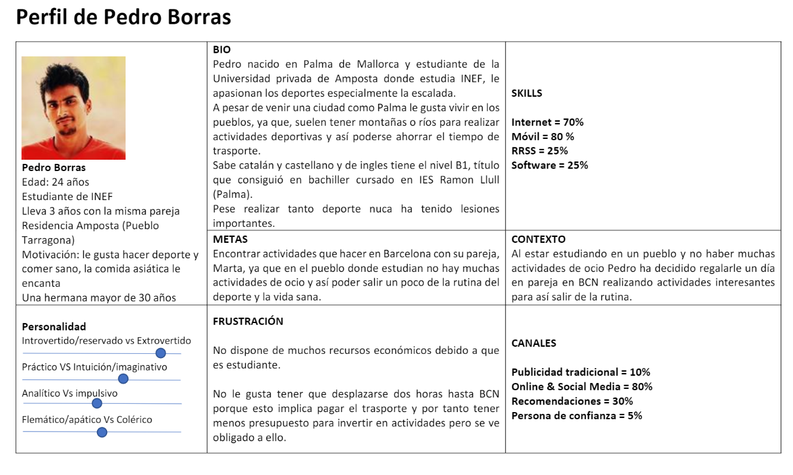
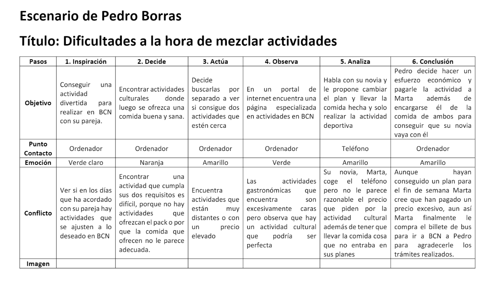

# DIU20
Prácticas Diseño Interfaces de Usuario 2019-20 (Economía Colaborativa) 

Grupo: DIU3.MAP  Curso: 2019/20 

Proyecto: FeverDIU

Descripción: En este proyecto vamos a realizar una aplicación móvil donde se priorizará los sistemas de valoraciones y la comodidad para publicar o ver las actividades que sufren modificaciones apareciendo en una sección específica, además añadiremos unos protocolos fáciles para poder registrarse, pagar o publicar actividades en la aplicación.    
Logotipo:    

Miembros
 *  Miguel Albertí Pons 

----- 

En esta práctica estudiaremos un caso de plataforma de economía colaborativa y realizaremos una propuesta para su diseño Web/movil. Utilizaremos herramientas y entregables descritos en el siguiente CheckList (https://github.com/mgea/UX-DIU-Checklist) 

Qué es economía colaborativa: Martínez-Polo, J. (2019). **El fenómeno del consumo colaborativo: del intercambio de bienes y servicios a la economía de las plataformas**, *Sphera Publica, 1*(19), 24-46. http://sphera.ucam.edu/index.php/sphera-01/article/view/363/14141434

>>> Este documento es el esqueleto del report final de la práctica. Aparte de subir cada entrega a PRADO, se debe actualizar y dar formato de informe final a este documento online. 

# Proceso de Diseño 

## Paso 1. UX Desk Research & Analisis 

 1.a Competitive Analysis
-----
Las aplicaciones que me han sido asignadas son aquellas en las cuales se facilita la búsqueda de actividades de ocio que se ajusten a los gustos de cada individuo.
Este conjunto de aplicaciones se caracterizan por ofrecer una lista de actividades divididas por unos filtros, comúnmente filtros de tipo de actividad como: deporte, gastronomía, arte, solidarias, etc; junto a filtros que acotan la zona geográfica donde buscar y filtros para acotar las fechas.
Una vez has encontrado la actividad deseada se pueden leer las condiciones generales y los requisitos que exige, finalmente cuando has visto todos los detalles se procede a pagar o a reservar la plaza según lo exija la actividad.

 1.b Persona
-----

* Enlace personas: https://github.com/MiguelAlberti/DIU20/blob/master/P1/Personas.pdf  

La primera persona que he escogido ha sido Pedro Borras, este joven estudiante que vive en un pueblo representa al conjunto de individuos que viven alejados de oportunidades de ocio diferentes y originales y se ve obligado a trasladarse a ciudades más grandes donde la oferta es mayor.  

En cambio Cristina Pascual tiene otro perfil, es una chica que ya tiene estudios e intenta emprender y crear una empresa capaz de organizar o publicitar eventos culturales, este tipo de usuarios representan a un conjunto de gente que a través de plataformas ya existentes quieren hacerse un hueco en el mercado.  

He escogido estos dos perfiles porque son casos bastante diferentes y porque creo que son dos situaciones que se pueden dar con gran facilidad actualmente.

 1.c User Journey Map
----
* Enlace Escenarios: https://github.com/MiguelAlberti/DIU20/blob/master/P1/Escenarios.pdf  

La historia de Pedro Borras la he escogido para reflejar todos los problemas que tiene una persona que vive en un pueblo alejado de grandes ciudades donde no solo debe preocuparse por encontrar la actividad adecuada sino que también por encontrar como llegar sin pagar un precio elevado por el trasporte, también intenta plasmar la falta de actividades bien sean de ocio o de otro tipo que hay en pueblos con un número de habitantes significativo.  

La historia de Cristina Pascual representa a una chica que ha acabado una carrera y un master y con lo aprendido quiere lograr crear una empresa que tenga relación con su pasión, el arte y eventos culturales de todo tipo, en el escenario podemos ver como cristina quiere hacerse hueco en el mercado y a través de fever consigue publicar un evento organizado por ella.  

 1.d Usability Review
----
* Página analizada: https://feverup.com/
* Enlace documento de Usability: https://github.com/MiguelAlberti/DIU20/blob/master/P1/Usability-review-template.xls
* Valoración final numérica: 83/100
* Comentario sobre la valoración: Es la primera vez que realizo una valoración de esta manera y en muchos puntos he dudado como valorar lo que me pedían, me he dado cuenta que apartados como en el de “form” no era necesario en esta app, ya que, registrarse en la página es muy simple, basta introducir el correo y tu contraseña para que todos tus datos de Google se relacionen con la app. Pese haber obtenido una buena puntuación tiene muchos aspectos a mejorar, sobretodo si quiere tener una comunidad que se comunique con facilidad a través de la app y donde un gran parte de usuarios publiquen actividades consiguiendo así una plataforma más dinámica.

## Paso 2. UX Design  

 2.a Feedback Capture Grid
----

* FeedbackCaptureGrid: https://github.com/MiguelAlberti/DIU20/blob/master/P2/FeedbackCaptureGrid.pdf

A partir del análisis de la etapa anterior y de haber realizado la feedback capture grid hemos encontrado muchos puntos a mejorar en la app fever.com, pero nos centraremos principalmente en los aspectos de chat, valoraciones, notificaciones y publicar actividades. En primer lugar realizaremos un sistema de nitificaciones tanto de actividades en las que estemos apuntados y sufran modificaciones como dar la posibilidad de suscriberse a algun tipo de actividad en específico y recibir notificaciones cuando se publiquen nuevas actividades. En segundo lugar creamos un sistema de valoraciones y comentarios presente en todas las actividades no como actualemente que solo esta presente en algunas y finalmente simplificar el proceso de de publicar una publicación estableciendo unos campos clave obligatorio sin tener que pasar por un registro  específico anterior.  

 2.b Tasks & Sitemap 
-----
* User/task matrix: https://github.com/MiguelAlberti/DIU20/blob/master/P2/User%20-%20task%20matrix.pdf  
* SiteMap: https://github.com/MiguelAlberti/DIU20/blob/master/P2/Arquitectura%20de%20la%20informaci%C3%B3n.pdf  

Sino tuviéramos colectivos, es decir, toda la aplicación fuera destinada para el mismo grupo de usuarios usaríamos User/Task flow, ya que, no haría falta distinguirlos porque todos realizarían las mismas funciones y por tanto sería más interesante centrarse en las tareas y sus relaciones. Pero al tener dos tipos de usuarios he decidido usar la técnica de User/task matrix.  

 2.c Labelling 
----
* Labelling: https://github.com/MiguelAlberti/DIU20/blob/master/P2/Arquitectura%20de%20la%20informaci%C3%B3n.pdf  

 2.d Wireframes
-----
* Bodetos Lo-Fi: https://github.com/MiguelAlberti/DIU20/blob/master/P2/Bocetos%20%20Lo-Fi.pdf

## Paso 3. Mi equipo UX-Case Study 

 3.a ¿Como se cuenta un UX-Case Study?
-----

#### Introducción

En la asignatura de DIU nos dieron la oportunidad de mejorar una página de organización y búsqueda de actividades de ocio, para ello cada alumno escogió una página web, en mi caso me he decantado por fever.com, página que creo que tiene muchos puntos positivos pero que a partir de las técnicas que hemos usado también he visto los defectos que tiene y las cosas a mejorar.

#### Personas 
En primer lugar creamos los perfiles de dos personas, Pedro y Cristina, el objetivo era conseguir dos usuarios potenciales de nuestro producto final, estas dos personas ficticias no fuerón creadas al azar sino que reúnen una serie de características que muy posiblemente tengan los usuarios finales de nuestra aplicación, la creación de estos dos usuarios nos ayudo a responder a la pregunta de "¿Para quién diseñamos?" ya que identificamos dos grupos de usuarios, los productores a los que representará Cristina y son aquellos que publican actividades y los consumidores que son aquellos que se apuntan a actividades y están representados por Pedro.

#### User Journey Map
Esta herramienta nos permite ver que pasos siguie el usuario  y que ocurre en su mente cuando usa nuestra aplicación, creamos dos User journey Map, uno para Pedro y otro para Crisitina para ver dos situaciones disitintas, una de publicación de actividad y otra de búsqueda.
* En el journey Map de Pedro nos queríamos centrar en que pasos que tenia que dar un usuario para conseguir reservar la actividad que quisiera y como llego a encontrar fever.com, Pedro encontro la aplicación por mediante un portal de internet y tuvo dificultades en encontrar pack de actividades y en poder aplicar filtros que le permitiesen encontrar actividades rápidamente en los dias que quería.  
* En el jouney Map de Cristina nos centramos en como una joven emprendedora quiere publicar actividades de su empresa para poder llegar a más gente, Cristina encontró problemas a la hora de llevar a cabo el registro de una actividad o las dificultades de comunicar cambios de hora o la propia cancelación del evento en el caso de que no contase con suficientes asistentes.

#### Usability Review
En el Usability Review nos centramos en la evaluación de la página de fever.com desde el punto de vista de un experto el resultado fue una puntuación de 83/100 y ver en que puntos se podría mejorar la página.    
    
Una vez realizamos estas técnicas pasamos a la etapa de diseño de nuestro aplicación para conseguir mejorar la página de fever.com, utilizamos varias técnicas.

#### Feedback Capture Grid

Esta técnica nos sirvió para recoger de una forma visual las críticas, los elementos de interés, las propuestas de usuario y las nuevas ideas que deberían aplicarse a la nueva página, de todo el análisis los puntos a destacar son la necesidad de un sistema de valoración para todas las actividades junto a un sistema de comentarios y la posibilidad de poder crear una chat para que los usuarios puedan interactuar entre ellos.

#### User task Matrix & Sitemap

Gracias a las ideas recogidas en la etapa anterior procedimos a crear una matriz donde plasmamos todas las tareas a realizar e indicando cuales serían las más críticas. En esta matriz aparecen tareas de la nueva propuesta como crear una ventana de comentarios y de valoración o tareas tan críticas y obvias como publicar actividad. En esta matriz no solo se representan tareas sino que se indican los grupos de individuos que identificamos al crear a las personas, consumidores y productores, y que tareas son más cruciales para cada grupo de usuarios.   

El SiteMap es una forma visual de observar como será la navegación dentro de nuestra página aplicación, pero no solo refleja la navegación sino que hemos añadido el **labelling**, es decir las palabras e iconos que tendrán nuestros bocetos/aplicación y que significado tiene cada uno. Para conseguir un labelling intuitivo y facil de entender tuvimos que ver los problemas con los que se habían encontrado nuestros usuarios y ver como podíamos resolverlos, nos decantamos por un lenguaje sencillo y la utilización de iconos presentes en muchas otras aplicaciones para que fuesen intuitivos y el usuario no tuviese que aprender nueva terminología ni asignar iconos a nuevos conceptos.

#### Bocetos Lo-fi 

En esta etapa recogimos toda la información generada en las etapas anteriores para empezar la etapa de diseño, realizamos unos primeros bocetos poco específicos donde se especificaba donde estarían los botones, imagenes, textos y demás componentes de nuestra aplicación además todos las nuevas ideas recogidas en el **task matrix** como una ventanda de opiniones, valoraciones en todas las actividades o notificaciones de actividades que sufriesen modificaciones. Después de los primeros bocetos tuvimos una reunión con la profesora en la cual nos dio su opinión y los problemas de la primera versión, gracias a ello llevamos a cabo una corrección de los bocetos para conseguir una versión próxima a la versión final.

  3.b Logotipo
----

>>> Si diseña un logotipo, explique la herramienta utilizada y la resolución empleada. ¿Puede usar esta imagen como cabecera de Twitter, por ejemplo, o necesita otra?

 3.c Guidelines
----

>>> Tras documentarse, muestre las deciones tomadas sobre Patrones IU a usar para la fase siguiente de prototipado. 

  3.d Video
----

>>> Documente y resuma el diseño de su producto en forma de video de 90 segundos aprox

## Paso 4. Evaluación 

 4.a Casos asignados
----

>>> Descripción de las asignaciones (3 UX Case Study) y enlace a  sus repositorios.

>>>> En la seccioón P4/readme.md se debe acceder además a sus respectivas hojas de evaluación y conclusiones 

 4.b User Testing
----

>>> Seleccione a una de sus personas ficticias. Exprese las ideas de posibles situaciones conflictivas de esa persona en las propuestas evaluadas

. 4.c Ranking 
----

>>> Concluya con un ranking de los casos evaluados 

>>> Valoración personal 

## Paso 5. Evaluación de Accesibilidad  

  5.a Accesibility evaluation Report
----

>>> Indica qué pretendes evaluar (de accesibilidad) y qué resultados has obtenido + Valoración personal

>>> Evaluación de la Accesibilidad (con simuladores o verificación de WACG) 

## Conclusión final / Valoración de las prácticas

>>> (90-150 palabras) Opinión del proceso de desarrollo de diseño siguiendo metodología UX y valoración (positiva /negativa) de los resultados obtenidos  

